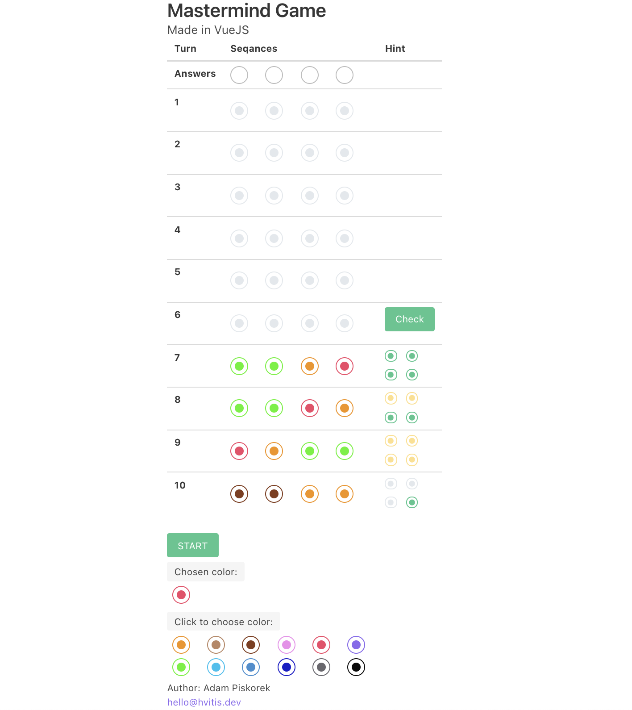
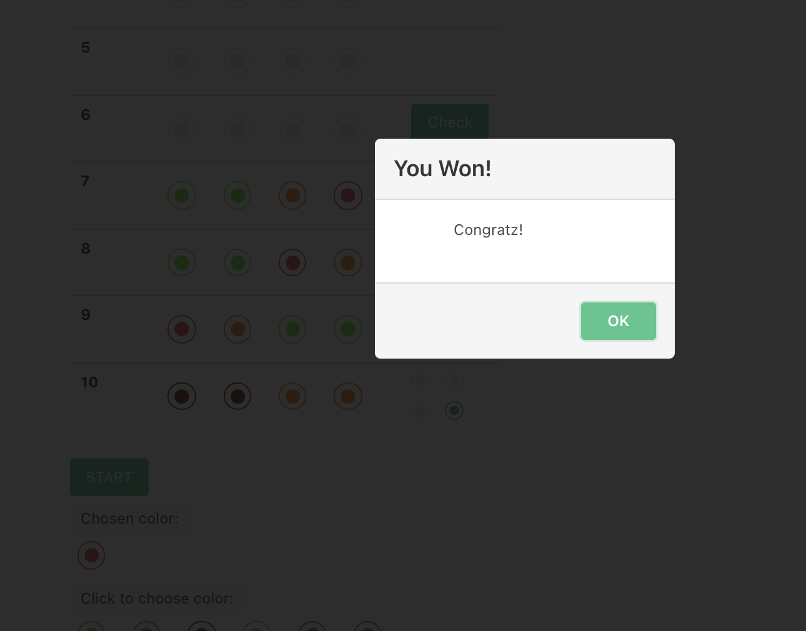

# Mastermind Game 🔵⚪️🔴🟢🟡🟣⚫️🟤🟠

## Gameplay

## Play

Enter [here][1] to play the game.

## Rules

- The computer picks a sequence of 4 colors (out of 12) unknown to player that are the solution.

- The objective of the game is to guess the exact positions of the colors in the computer's sequence.

- By default, sequence generated by the computer consist of unique colors, without duplications.

- After filling a line with your guesses and clicking on the 'Check' button, the computer responses with the result of your guess.

- For each color in your guess that is in the correct color and correct position in the code sequence, the computer display a small green color on the right side of the current guess.

- For each color in your guess that is in the correct color but is NOT in the correct position in the code sequence, the computer display a small yellow color on the right side of the current guess.

- For each color in your guess that is in the incorrect color AND in the incorrect position in the code sequence, the computer display a small whitish color.

- The order of color displays in the right panel does not correlate with the positioning of chosen colors in a row.

- You win the game when you manage to guess all the colors in the code sequence and when they all in the right position.

- You lose the game if you use all attempts (10) without guessing the computer code sequence.

### Info

Rules taken and modified from [here][0].

[0]: https://www.web-games-online.com/mastermind/rules.php
[1]: https://naughty-neumann-edacfc.netlify.app/